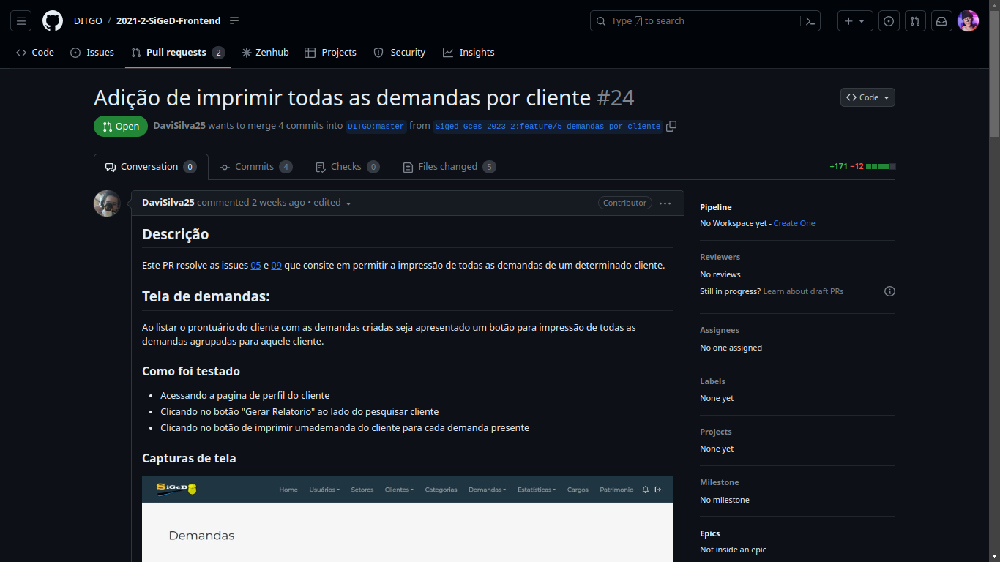
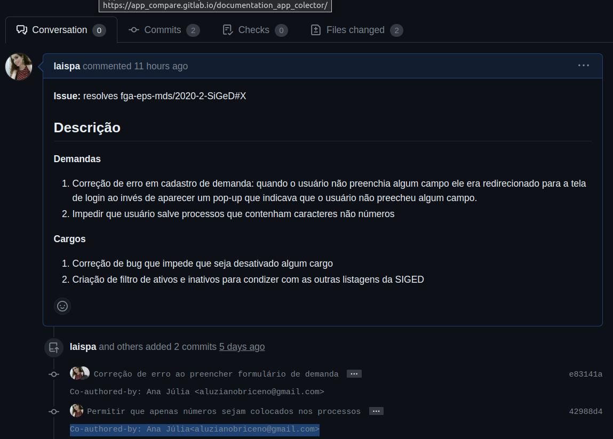
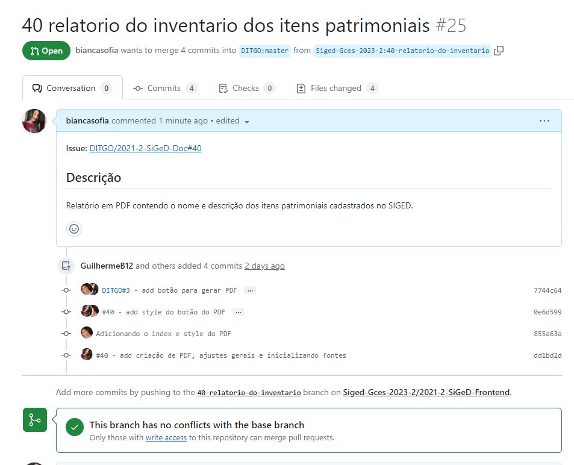
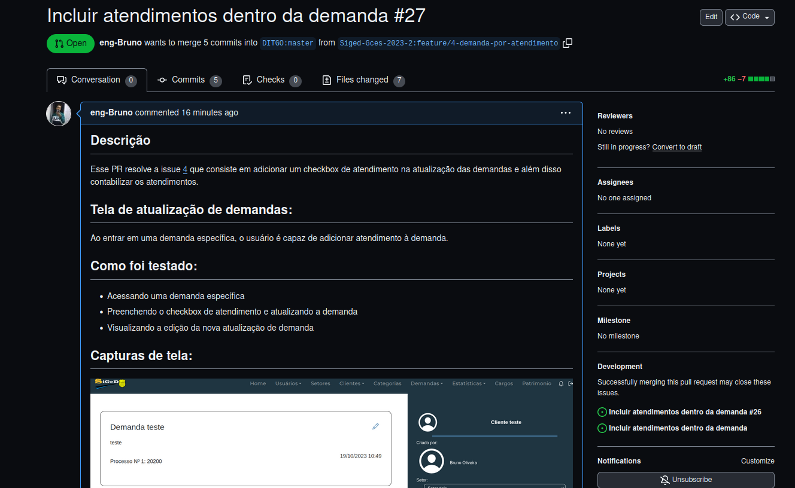
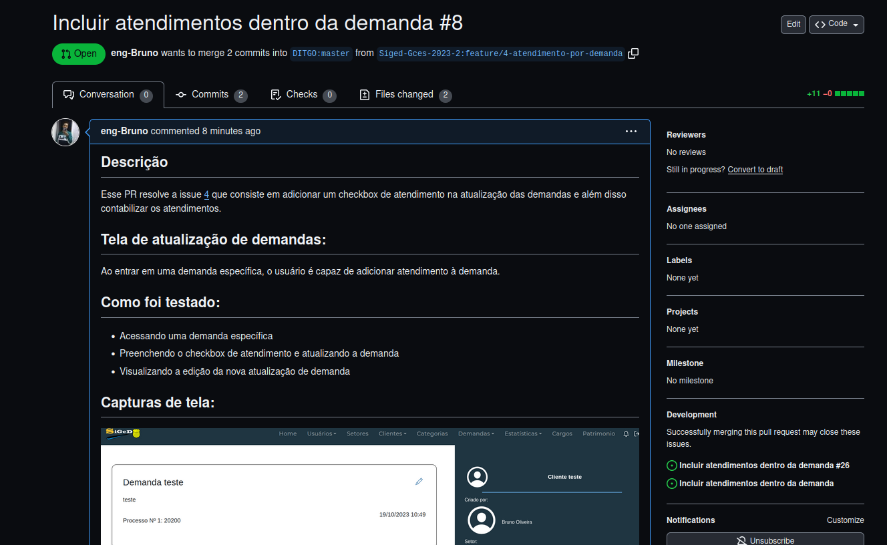

# Sprint 2

## Duração
- Início: 10/10/2023
- Término: 19/10/2023

## Planejamento
- Dividir pareamentos;
- Cada pareamento responsável por escolher e desenvolver uma issue;
- Criação de um meio de comunicação com o mantenedor;
- Reunião com o mantenedor para alinhar as issues e pull requests.

### Issues planejadas e pareamentos
| ID | Descrição | Responsáveis |
| :--: | :-----: | :----------: |
| [#2](https://github.com/Siged-Gces-2023-2/2023.2-SIGeD-GCES-Doc/issues/2) | Criar gráfico Estatístico de Demandas por Características | Lucas Lopes e Davi Lima |
| [#9](https://github.com/Siged-Gces-2023-2/2023.2-SIGeD-GCES-Doc/issues/9) | Impressão de Relatório de Demandas na Tela de Perfil do Cliente | Lucas Lopes e Davi Lima |
| [#X]() | Descrição da issue | Laís Aguiar e Ana Júlia |
| [#3](https://github.com/Siged-Gces-2023-2/2023.2-SIGeD-GCES-Doc/issues/3) | Criar o relatório do Inventário dos itens patrimoniais do SIGED | Bianca Sofia e Guilherme Brito |
| [#4](https://github.com/Siged-Gces-2023-2/2023.2-SIGeD-GCES-Doc/issues/4) | Incluir atendimentos dentro da demanda | Bruno Oliveira e Gustavo Barbosa |
| [#X]() | Descrição da issue | Artur Sousa e Débora Caires |

<figcaption align="center">Tabela 1: Issues planejadas na sprint. (Fonte: Autor, 2023)</figcaption>

## Execução
- Dividimos os pareamentos;
- Cada pareamento escolheu e iniciou o desenvolvimento de uma issue, por responsabilidade própria;
- Criamos um canal no Discord para comunicação direta com o mantenedor. Além da possibilidade de chamada, também existem os chats para rápida comunicação;
- Reunião feita com o mantenedor às 20h do dia 17/10/2023.

### Issues executadas
| ID | Descrição | Responsáveis | Status |
| :--: | :-----: | :----------: | :----: |
| [#2](https://github.com/Siged-Gces-2023-2/2023.2-SIGeD-GCES-Doc/issues/2) | Criar gráfico Estatístico de Demandas por Características | Lucas Lopes e Davi Lima | Não iniciada/Em andamento/Concluída |
| [#9](https://github.com/Siged-Gces-2023-2/2023.2-SIGeD-GCES-Doc/issues/9) | Impressão de Relatório de Demandas na Tela de Perfil do Cliente | Lucas Lopes e Davi Lima | Concluída |
| [#8](https://github.com/Siged-Gces-2023-2/2023.2-SIGeD-GCES-Doc/issues/8) | Descrição da issue | Laís Aguiar e Ana Júlia | Concluída |
| [#3](https://github.com/Siged-Gces-2023-2/2023.2-SIGeD-GCES-Doc/issues/3) | Criar o relatório do Inventário dos itens patrimoniais do SIGED | Bianca Sofia e Guilherme Brito | Concluída |
| [#4](https://github.com/Siged-Gces-2023-2/2023.2-SIGeD-GCES-Doc/issues/4) | Incluir atendimentos dentro da demanda | Bruno Oliveira e Gustavo Barbosa | Concluída |
| [#X]() | Descrição da issue | Artur Sousa e Débora Caires | Não iniciada/Em andamento/Concluída |

<figcaption align="center">Tabela 2: Issues finalizadas com sucesso na sprint. (Fonte: Autor, 2023)</figcaption>

### Pull Requests
A seguir informamos os PRs feitos pelos integrantes junto às suas informações.

---

- **Autores:** Lucas Lopes e Davi Lima
- **ID e Descrição do PR:** [#Y - Descrição do PR]()
- **ID e Descrição da Issue:** [#2 - Criar gráfico Estatístico de Demandas por Características](https://github.com/Siged-Gces-2023-2/2023.2-SIGeD-GCES-Doc/issues/2)
- **Data do PR:** dd/mm/aaaa
- **Screenshot:**

<figcaption align="center">Figura 1: Pull Request da issue #2. (Fonte: Autor, 2023)</figcaption>

---

- **Autores:** Lucas Lopes e Davi Lima
- **ID e Descrição do PR:** [#24 - Adição de imprimir todas as demandas por cliente](https://github.com/DITGO/2021-2-SiGeD-Frontend/pull/24)
- **ID e Descrição da Issue:** [#9 - Impressão de Relatório de Demandas na Tela de Perfil do Cliente](https://github.com/Siged-Gces-2023-2/2023.2-SIGeD-GCES-Doc/issues/9)
- **Data do PR:** 05/10/2023
- **Screenshot:**

<figcaption align="center">Figura 2: Pull Request da issue #9. (Fonte: Autor, 2023)</figcaption>

---

- **Autores:** Laís Aguiar e Ana Júlia
- **ID e Descrição do PR:** [#26 - Correcoes e melhorias em Demandas e Cargos]()
- **ID e Descrição da Issue:** [#8 - Correção de Erros e Melhorias](https://github.com/Siged-Gces-2023-2/2023.2-SIGeD-GCES-Doc/issues/8)
- **Data do PR:** 19/10/2023
- **Screenshot:**

<figcaption align="center">Figura 3: Pull Request da issue #X. (Fonte: Autor, 2023)</figcaption>

---

- **Autores:** Bianca Sofia e Guilherme Brito
- **ID e Descrição do PR:** [#25 - Relatório em PDF contendo o nome e descrição dos itens patrimoniais cadastrados no SIGED.](https://github.com/DITGO/2021-2-SiGeD-Frontend/pull/25)
- **ID e Descrição da Issue:** [#3 - Criar o relatório do Inventário dos itens patrimoniais do SIGED](https://github.com/Siged-Gces-2023-2/2023.2-SIGeD-GCES-Doc/issues/3)
- **Data do PR:** 18/10/2023
- **Screenshot:**

<figcaption align="center">Figura 4: Pull Request da issue #X. (Fonte: Autor, 2023)</figcaption>

---

- **Autores:** Bruno Oliveira e Gustavo Barbosa
- **ID e Descrição do PR:** [#27 - Incluir atendimentos dentro da demanda](https://github.com/DITGO/2021-2-SiGeD-Frontend/pull/27) e [#8 - Incluir atendimentos dentro da demanda](https://github.com/DITGO/2021-2-SiGeD-Demands/pull/8)
- **ID e Descrição da Issue:** [#4 - Incluir atendimentos dentro da demanda](https://github.com/Siged-Gces-2023-2/2023.2-SIGeD-GCES-Doc/issues/4)
- **Data do PR:** 19/10/2023
- **Screenshot:**

<figcaption align="center">Figura 5: Pull Request da issue #X. (Fonte: Autor, 2023)</figcaption>

---

- **Autores:** Artur Sousa e Débora Caires
- **ID e Descrição do PR:** [#Y - Descrição do PR]()
- **ID e Descrição da Issue:** [#X - Descrição da Issue]()
- **Data do PR:** dd/mm/aaaa
- **Screenshot:**

<figcaption align="center">Figura 6: Pull Request da issue #X. (Fonte: Autor, 2023)</figcaption>

---

## Conclusão
Escrever uma reflexão simples e direta sobre a sprint em questão. Experiências, dificuldades, melhorias...

## Histórico de versão
| Versão | Data | Descrição | Autor |
| :----: | :--: | :-------: | :---: |
| 1.0 | 16/10/2023 | Criação inicial do documento | Lucas Lopes |
| 1.1 | 18/10/2023 | Inclusão de novo PR | Lucas Lopes |
| 1.2 | 18/10/2023 | Inclusão de novo PR | Bianca Sofia |