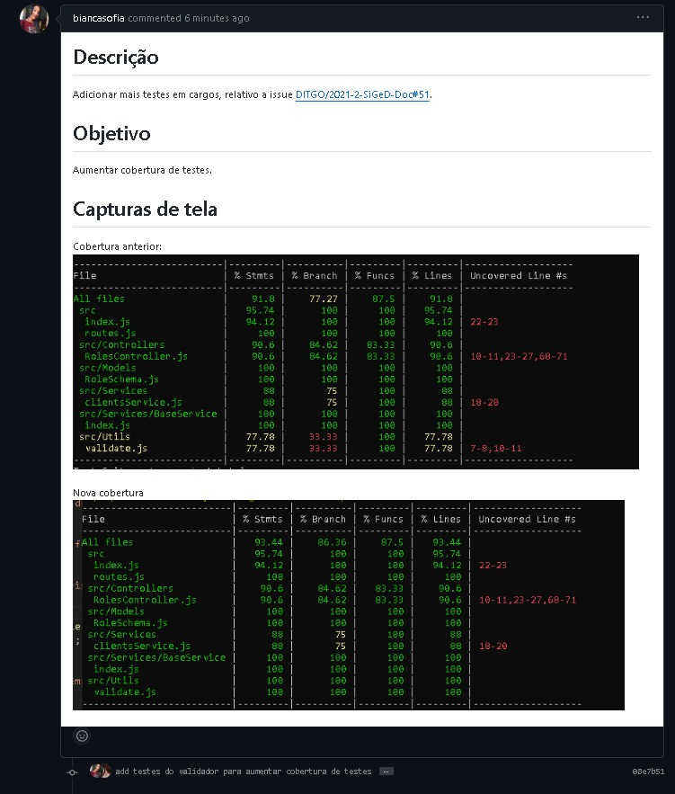
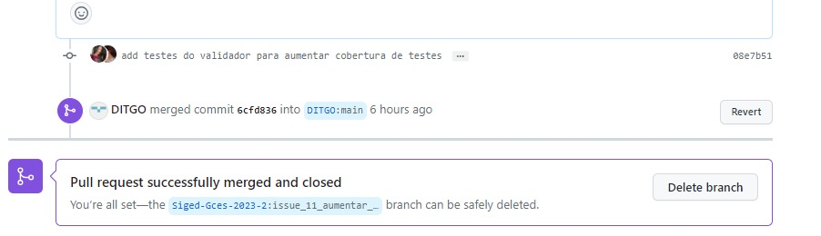

# Sprint 3

## Duração
- Início: 24/10/2023
- Término: 07/11/2023

## Planejamento
- Dividir pareamentos;
- Cada pareamento responsável por escolher e desenvolver uma issue.

## Execução
- Dividimos os pareamentos;
- Cada pareamento escolheu e iniciou o desenvolvimento de uma issue, por responsabilidade própria.

### Issues executadas e pareamentos
| ID | Descrição | Responsáveis | Status |
| :--: | :-----: | :----------: | :----: |
| [#1](https://github.com/Siged-Gces-2023-2/2023.2-SIGeD-GCES-Doc/issues/1) | Criar relatório Estatístico de Demandas por Características | Lucas Lopes e Davi Lima | Concluída |
| [#2](https://github.com/Siged-Gces-2023-2/2023.2-SIGeD-GCES-Doc/issues/2) | Criar gráfico Estatístico de Demandas por Características | Lucas Lopes e Davi Lima | Concluída |
| [#11](https://github.com/Siged-Gces-2023-2/2023.2-SIGeD-GCES-Doc/issues/11) | Aumentar cobertura de testes em Cargos | Bianca Sofia e Guilherme Brito | Concluída |
| [#X]() | Descrição da Issue | Bruno Oliveira e Gustavo Barbosa | Não iniciada/Em andamento/Concluída |
| [#X]() | Descrição da Issue | Laís Aguiar e Ana Júlia | Não iniciada/Em andamento/Concluída |
| [#X]() | Descrição da Issue | Artur Sousa e Débora Caires | Não iniciada/Em andamento/Concluída |

<figcaption align="center">Tabela 1: Issues executadas na sprint. (Fonte: Autor, 2023)</figcaption>

### Pull Requests
A seguir informamos os PRs feitos pelos integrantes junto às suas informações.

---

- **Autores:** Lucas Lopes e Davi Lima
- **ID e Descrição do(s) PR(s):**
    - [#28 - Adição de gráfico de demandas por caracteristicas](https://github.com/DITGO/2021-2-SiGeD-Frontend/pull/28)
    - [#10 - Adição de gráfico de demandas por caracteristicas](https://github.com/DITGO/2021-2-SiGeD-Demands/pull/10)
- **ID e Descrição da(s) Issue(s):**
    - [#1 - Criar relatório Estatístico de Demandas por Características](https://github.com/Siged-Gces-2023-2/2023.2-SIGeD-GCES-Doc/issues/1)
    - [#2 - Criar gráfico Estatístico de Demandas por Características](https://github.com/Siged-Gces-2023-2/2023.2-SIGeD-GCES-Doc/issues/2)
- **Data do PR:** 19/10/2023
- **Screenshot:**

<figcaption align="center">Figura 1: Pull Request da issue #1 e #2. (Fonte: Autor, 2023)</figcaption>

---

- **Autores:** Laís Aguiar e Ana Júlia
- **ID e Descrição do(s) PR(s):** [#Y - Descrição do PR]()
- **ID e Descrição da(s) Issue(s):** [#X - Descrição da Issue]()
- **Data do PR:** dd/mm/aaaa
- **Screenshot:**

<figcaption align="center">Figura 2: Pull Request da issue #11. (Fonte: Autor, 2023)</figcaption>

---

- **Autores:** Bianca Sofia e Guilherme Brito
- **ID e Descrição do(s) PR(s):** [#11 - Adição de testes do validador para aumentar cobertura de testes](https://github.com/DITGO/2021-2-SiGeD-Cargos/pull/11)
- **ID e Descrição da(s) Issue(s):** [#11 - Aumentar cobertura de testes em Cargos](https://github.com/Siged-Gces-2023-2/2023.2-SIGeD-GCES-Doc/issues/11)
- **Data do PR:** 05/11/2023
- **Screenshot:**

<figcaption align="center">Figura 3: Pull Request da issue #11. (Fonte: Autor, 2023)</figcaption>

---

- **Autores:** Bruno Oliveira e Gustavo Barbosa
- **ID e Descrição do(s) PR(s):** [#Y - Descrição do PR]()
- **ID e Descrição da(s) Issue(s):** [#X - Descrição da Issue]()
- **Data do PR:** dd/mm/aaaa
- **Screenshot:**

<figcaption align="center">Figura 4: Pull Request da issue #X. (Fonte: Autor, 2023)</figcaption>

---

- **Autores:** Artur Sousa e Débora Caires
- **ID e Descrição do(s) PR(s):** [#Y - Descrição do PR]()
- **ID e Descrição da(s) Issue(s):** [#X - Descrição da Issue]()
- **Data do PR:** dd/mm/aaaa
- **Screenshot:**

<figcaption align="center">Figura 5: Pull Request da issue #X. (Fonte: Autor, 2023)</figcaption>

---

## Conclusão
Escrever uma reflexão simples e direta sobre a sprint em questão. Experiências, dificuldades, melhorias...

## Histórico de versão
| Versão | Data | Descrição | Autor |
| :----: | :--: | :-------: | :---: |
| 1.0 | 05/11/2023 | Criação inicial do documento | Lucas Lopes |
| 1.1 | 06/11/2023 | Adição de novo PR | Bianca Sofia |
| 1.2 | 09/11/2023 | Correção PR 10 e 28 | Davi Lima |

