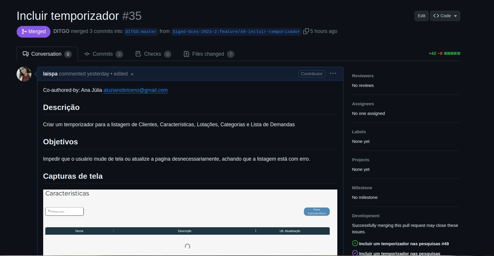

# Sprint 4

## Duração
- Início: 07/11/2023
- Término: 16/11/2023

## Planejamento
- Dividir pareamentos;
- Cada pareamento responsável por escolher e desenvolver uma issue.

## Execução
- Dividimos os pareamentos;
- Cada pareamento escolheu e iniciou o desenvolvimento de uma ou mais issues, por responsabilidade própria.

### Issues executadas e pareamentos
| ID | Descrição | Responsáveis | Status |
| :--: | :-----: | :----------: | :----: |
| [#16](https://github.com/Siged-Gces-2023-2/2023.2-SIGeD-GCES-Doc/issues/16) | Ajustar o posicionamento do botão Gerar PDF na tela de Patrimônio | Lucas Lopes e Davi Lima | Concluída |
| [#17](https://github.com/Siged-Gces-2023-2/2023.2-SIGeD-GCES-Doc/issues/17) | Aumentar cobertura de testes em demands | Bianca Sofia | Em andamento |
| [#18](https://github.com/Siged-Gces-2023-2/2023.2-SIGeD-GCES-Doc/issues/18) | Erro no cadastro de itens patrimoniais | Bruno Oliveira e Gustavo Barbosa | Concluída |
| [#12](https://github.com/Siged-Gces-2023-2/2023.2-SIGeD-GCES-Doc/issues/12) | Incluir um temporizador nas pesquisas  | Laís Aguiar e Ana Júlia | Concluída |
| [#20](https://github.com/Siged-Gces-2023-2/2023.2-SIGeD-GCES-Doc/issues/20) | Correção de problema no ESLint em patrimonio  | Laís Aguiar e Ana Júlia | Em andamento |

<figcaption align="center">Tabela 1: Issues executadas na sprint. (Fonte: Autor, 2023)</figcaption>

### Pull Requests
A seguir informamos os PRs feitos pelos integrantes junto às suas informações.

---

- **Autores:** Lucas Lopes e Davi Lima
- **ID e Descrição do(s) PR(s):** [#34 - Ajuste do posicionamento do botão Gerar PDF na tela de Patrimônio](https://github.com/DITGO/2021-2-SiGeD-Frontend/pull/34)
- **ID e Descrição da(s) Issue(s):** [#16 - Ajustar o posicionamento do botão Gerar PDF na tela de Patrimônio](https://github.com/Siged-Gces-2023-2/2023.2-SIGeD-GCES-Doc/issues/16)
- **Data do PR:** 13/11/2023
- **Screenshot:**

<figcaption align="center">Figura 1: Pull Request da issue #16. (Fonte: Autor, 2023)</figcaption>

---

- **Autores:** Laís Aguiar e Ana Júlia
- **ID e Descrição do(s) PR(s):** 
    - [#35 - Incluir temporizador](https://github.com/DITGO/2021-2-SiGeD-Frontend/pull/35)
    - [#4 -Corrreção de problema no ESlint](https://github.com/DITGO/2021-2-SiGeD-Patrimonio/pull/4)
- **ID e Descrição da(s) Issue(s):** 
    - [#12 - Incluir um temporizador nas pesquisas](https://github.com/Siged-Gces-2023-2/2023.2-SIGeD-GCES-Doc/issues/12)
    - [#20 - Correção de problema no ESLint em patrimônio](https://github.com/Siged-Gces-2023-2/2023.2-SIGeD-GCES-Doc/issues/20)
- **Data do PR:** 15/11/2023
- **Screenshot:**

<figcaption align="center">Figura 2: Pull Request das issues #12 e #20. (Fonte: Autor, 2023)</figcaption>

---

- **Autores:** Bianca Sofia Brasil
- **ID e Descrição do(s) PR(s):** Issue sem PR, pois está em andamento.
- **ID e Descrição da(s) Issue(s):** [#17 - Aumentar cobertura de testes em demands](https://github.com/Siged-Gces-2023-2/2023.2-SIGeD-GCES-Doc/issues/17)
- **Data do PR:** dd/mm/aaaa
- **Screenshot:**

<figcaption align="center">Figura 3: Cobertura de testes anterior #17. (Fonte: Autor, 2023)</figcaption>

---

- **Autores:** Bruno Oliveira e Gustavo Barbosa
- **ID e Descrição do(s) PR(s):** [#5 - Corrigindo erro no Cadastro de Itens Patrimoniais](https://github.com/DITGO/2021-2-SiGeD-Patrimonio/pull/5)
- **ID e Descrição da(s) Issue(s):** [#18 - Erro no Cadastro de Itens Patrimoniais](https://github.com/Siged-Gces-2023-2/2023.2-SIGeD-GCES-Doc/issues/18)
- **Data do PR:** 15/11/2023
- **Screenshot:**

<figcaption align="center">Figura 4: Pull Request da issue #18. (Fonte: Autor, 2023)</figcaption>

---

## Conclusão
O grupo conseguiu resolver 3 issues e 2 em andamento. Entre elas, algumas novas criadas pelo mantenedor e outras novas que contribuem para a melhoria de usabilidade e segurança. Os integrantes Artur Sousa, Débora Caires e Guilherme Brito não contribuíram para essa sprint.

## Histórico de versão
| Versão | Data | Descrição | Autor |
| :----: | :--: | :-------: | :---: |
| 1.0 | 13/11/2023 | Documentação inicial | Lucas Lopes |
| 1.2 | 16/11/2023 | Adicionando prints e issue | Bianca Sofia |
| 1.3 | 16/11/2023 | Adicionando prints e issue | Laís Portela |