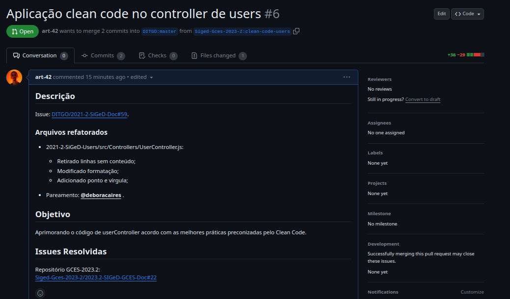

# Sprint 5

## Duração
- Início: 21/11/2023
- Término: 05/12/2023

## Planejamento
- Dividir pareamentos;
- Cada pareamento responsável por escolher e desenvolver uma issue.

## Execução
- Dividimos os pareamentos. Os pareamentos se mantiveram;
- Cada pareamento escolheu e iniciou o desenvolvimento de uma ou mais issues, por responsabilidade própria.

### Issues executadas e pareamentos
| ID | Descrição | Responsáveis | Status |
| :--: | :-----: | :----------: | :----: |
| [#22](https://github.com/Siged-Gces-2023-2/2023.2-SIGeD-GCES-Doc/issues/22) | Aplicar princípios do Clean Code em Demands | Lucas Lopes e Davi Lima | Concluída |
| [#19](https://github.com/Siged-Gces-2023-2/2023.2-SIGeD-GCES-Doc/issues/19) | Erro na validação do CPF no cadastro do cliente | Bianca Sofia e Laís Portela | Concluída |
| [#23](https://github.com/Siged-Gces-2023-2/2023.2-SIGeD-GCES-Doc/issues/23) | Aplicar princípios do Clean Code em Clients | Bianca Sofia e Laís Portela  | Concluída |
| [#X]() | Descrição da Issue | Bruno Oliveira e Gustavo Barbosa | Não iniciada/Em andamento/Concluída |
| [#24](https://github.com/Siged-Gces-2023-2/2023.2-SIGeD-GCES-Doc/issues/24) | Aplicar princípios do Clean Code em Users | Artur Sousa e Débora Caires | Concluída |

<figcaption align="center">Tabela 1: Issues executadas na sprint. (Fonte: Autor, 2023)</figcaption>

### Pull Requests
A seguir informamos os PRs feitos pelos integrantes junto às suas informações.

---

- **Autores:** Lucas Lopes e Davi Lima
- **ID e Descrição do(s) PR(s):** [#12 - Aplicação de princípios do Clean Code em CategoryController e AlertController](https://github.com/DITGO/2021-2-SiGeD-Demands/pull/12)
- **ID e Descrição da(s) Issue(s):** [#22 - Aplicar princípios do Clean Code em Demands](https://github.com/Siged-Gces-2023-2/2023.2-SIGeD-GCES-Doc/issues/22)
- **Data do PR:** 30/11/2023
- **Screenshot:**

<figcaption align="center">Figura 1: Pull Request da issue #22. (Fonte: Autor, 2023)</figcaption>

---

- **Autores:** Bianca Sofia e Laís Aguiar
- **ID e Descrição do(s) PR(s):** [#36 - Correção mensagem cpf inválido](https://github.com/DITGO/2021-2-SiGeD-Frontend/pull/36)
- **ID e Descrição da(s) Issue(s):** [#19 - Erro na validação do CPF no cadastro do cliente](https://github.com/Siged-Gces-2023-2/2023.2-SIGeD-GCES-Doc/issues/19)
- **Data do PR:** 30/11/2023
- **Screenshot:**

<figcaption align="center">Figura 2: Pull Request da issue #19. (Fonte: Autor, 2023)</figcaption>

---

- **Autores:** Bianca Sofia e Laís Aguiar
- **ID e Descrição do(s) PR(s):** [#12 - Aplicando clean code](https://github.com/DITGO/2021-2-SiGeD-Clients/pull/12)
- **ID e Descrição da(s) Issue(s):** [#23 - Aplicar princípios do Clean Code em Clients](https://github.com/Siged-Gces-2023-2/2023.2-SIGeD-GCES-Doc/issues/23)
- **Data do PR:** 30/11/2023
- **Screenshot:**

<figcaption align="center">Figura 3: Pull Request da issue #23. (Fonte: Autor, 2023)</figcaption>

---

- **Autores:** Bruno Oliveira e Gustavo Barbosa
- **ID e Descrição do(s) PR(s):** [#Y - Descrição do PR]()
- **ID e Descrição da(s) Issue(s):** [#X - Descrição da Issue]()
- **Data do PR:** dd/mm/aaaa
- **Screenshot:**

<figcaption align="center">Figura 4: Pull Request da issue #X. (Fonte: Autor, 2023)</figcaption>

---

- **Autores:** Artur Sousa e Débora Caires
- **ID e Descrição do(s) PR(s):** [#6 - Aplicação clean code no controller de users](https://github.com/DITGO/2021-2-SiGeD-Users/pull/6)
- **ID e Descrição da(s) Issue(s):** [#24 - Aplicar princípios do Clean Code em Users](https://github.com/Siged-Gces-2023-2/2023.2-SIGeD-GCES-Doc/issues/24   )
- **Data do PR:** 05/12/2023
- **Screenshot:**

<figcaption align="center">Figura 5: Pull Request da issue #24. (Fonte: Autor, 2023)</figcaption>

---

## Conclusão
Escrever uma reflexão simples e direta sobre a sprint em questão. Experiências, dificuldades, melhorias...

## Histórico de versão
| Versão | Data | Descrição | Autor |
| :----: | :--: | :-------: | :---: |
| 1.0 | 20/11/2023 | Iniciação do documento | Lucas Lopes |
| 1.1 | 30/11/2023 | Adição da issue 22 concluída | Lucas Lopes |
| 1.2 | 30/11/2023 | Adição das issues 19 e 23 concluídas | Bianca Sofia |
| 1.3 | 05/12/2023 | Adição da issue 24 concluída | Artur de Sousa |